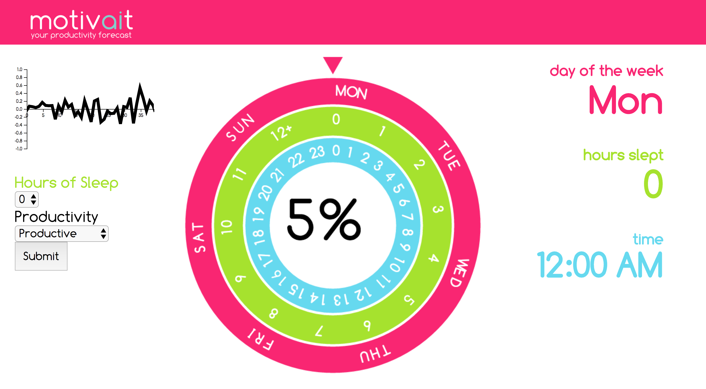

# HackUVA2017

For HackUVA2017 we created "motivait," a productivity app that learns your behavior over time. 
The app sends push notifications to your phone throughout your day and keeps track of trends in your 
productive behavior, and then uses a neural network on the backend to predict your future productivity.  

In this demo, we show what the interface for the app might look like. Currently, the demo app's backend is
a pseudo-neural net that takes in data we generate--for this app to be functional, we suggest at least two 
weeks worth of user data to get meaningful predictions.   

Contributors:  
Devin Kim    
Eli Lifland   
Aaron Ho  
Karl Keat  
